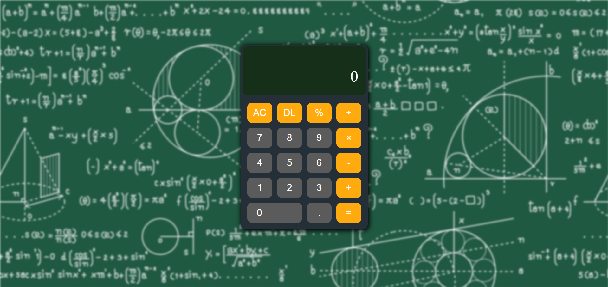
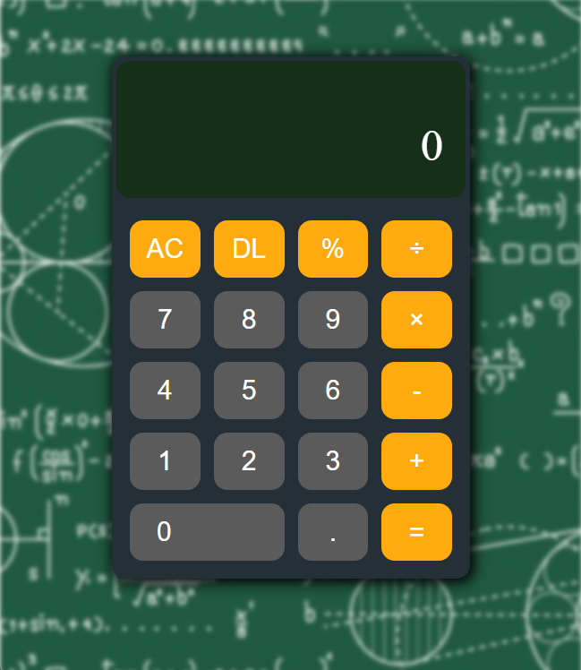

# 🧮 Simple Calculator – Day 1 @ SELISE Industrial Attachment

This is a basic calculator built using HTML, CSS, and JavaScript. It supports basic arithmetic operations: addition, subtraction, multiplication, and division. Built as a Day 1 task during my industrial attachment at SELISE.

---

## 🔍 Features

- Basic arithmetic: `+`, `−`, `×`, `÷`
- Decimal input and percent calculation
- Clear and delete functionalities
- Responsive UI (Desktop + Mobile)
- Keyboard input support

---

## 📸 Screenshots

---

## 🚀 How to Run

website is live at - https://my-calculator-mu-nine.vercel.app/

---

## 🛠️ Tech Stack

- HTML
- CSS
- JavaScript (Vanilla)

---

## 📅 Project Info

- **Date:** 18 - 05 - 2025
- **Developer:** Md. Abir Hasan

---
